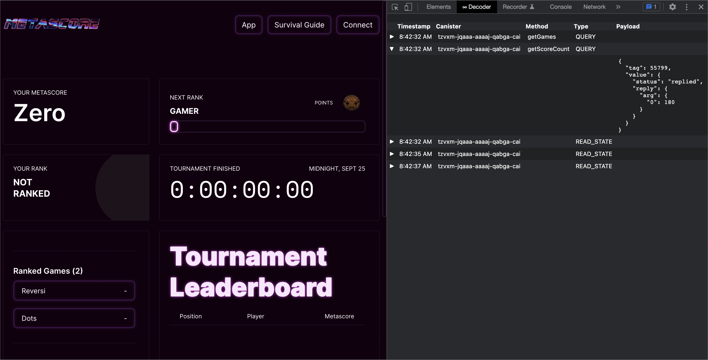

# Dfinity Decoder

A little chrome extension to decode CBOR/Candid responses from the Dfinity blockchain in Chrome devtools.

[Download from the Chrome Web Store](https://chrome.google.com/webstore/detail/dfinity-decoder/meaadkenfkhjakkkdapaallimhbdofck)

ICP Tips: 799d9974ec7604d031c34ea487015ef7efc92f283da4ce0b84a3aaadbeae0934

## Why?

Developing on the Dfinity Blockchain, you will see ugly responses in the chrome devtools network tab:


This extension decodes responses from canisters into something more readable:



### Development

For development with automatic reloading:

```sh
npm run start
```

Open the [Extensions Dashboard](chrome://extensions), enable "Developer mode", click "Load unpacked", and choose the `dist` folder.

You will see the "Dfinity" tab in your devtools window.

When you make changes in `src` the background script and any content script will reload automatically.

### Production

When it's time to publish your Chrome extension, make a production build to submit to the Chrome Web Store. This boilerplate will use the version in `package.json`, unless you add a version to `src/manifest.json`.

> Make sure you have updated the name and version of your extension in `package.json`.

Run the following line:

```sh
npm run build
```

This will create a ZIP file with your package name and version in the `releases`
folder.

This library was incentivized by [ICDevs](https://ICDevs.org). You can view more about the bounty on the [forum](https://forum.dfinity.org/t/cbor-plug-in-or-tools/4556/27?u=skilesare) or [website](https://icdevs.org/bounties/2021/11/23/CBOR-plug-in.html). The bounty was funded by The ICDevs.org commuity and the award paid to @jorgenbuilder. If you use this library and gain value from it, please consider a [donation](https://icdevs.org/donations.html) to ICDevs.
