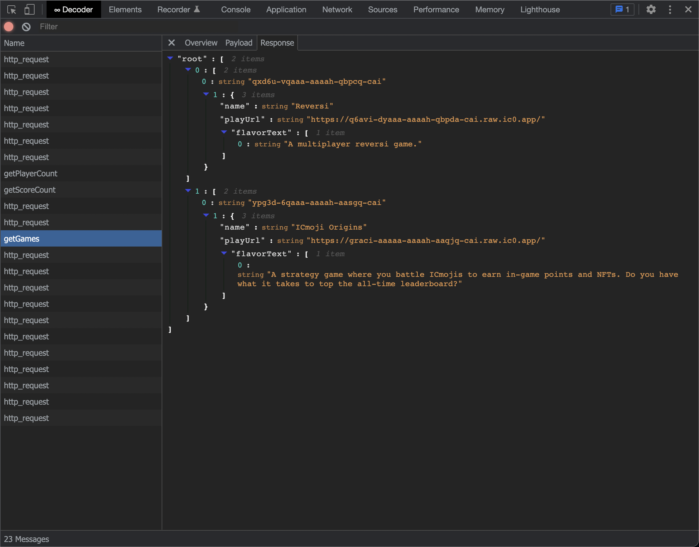

# IC Inspector

A little chrome extension to decode CBOR/Candid responses from the Internet
Computer blockchain in Chrome devtools.

[Download from the Chrome Web Store](https://chrome.google.com/webstore/detail/dfinity-decoder/meaadkenfkhjakkkdapaallimhbdofck)

ICP Tips: 799d9974ec7604d031c34ea487015ef7efc92f283da4ce0b84a3aaadbeae0934

## Why?

Developing on the Internet Computer blockchain, you will see ugly responses in
the chrome devtools network tab:


This extension decodes responses from canisters into something more readable:



### Development

For development with automatic reloading:

```sh
npm run start
```

Open the [Extensions Dashboard](chrome://extensions), enable "Developer mode",
click "Load unpacked", and choose the `dist` folder.

You will see the "Dfinity" tab in your devtools window.

When you make changes in `src` the background script and any content script will
reload automatically.

**Storybook**

To simplify testing and development the extension's UIs, storybook is available
with a set of message stubs captured from real IC apps.

`npm run storybook`


### Releasing

Pushing a new tag to github will trigger a release to the chrome webstore.

1. Bump the version in `manifest.json`
2. Create a new git tag with the same string
3. Push code and tags to github

```sh
git tag vX.X.X
git push origin main
git push origin --tags
```

## Funding

This library was originally incentivized by [ICDevs](https://ICDevs.org). You
can view more about the bounty on the
[forum](https://forum.dfinity.org/t/cbor-plug-in-or-tools/4556/27?u=skilesare)
or [website](https://icdevs.org/bounties/2021/11/23/CBOR-plug-in.html). The
bounty was funded by The ICDevs.org commuity and the award paid to
@jorgenbuilder. If you use this library and gain value from it, please consider
a [donation](https://icdevs.org/donations.html) to ICDevs.
