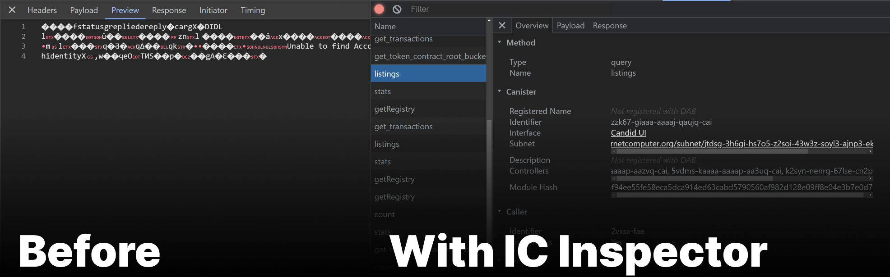
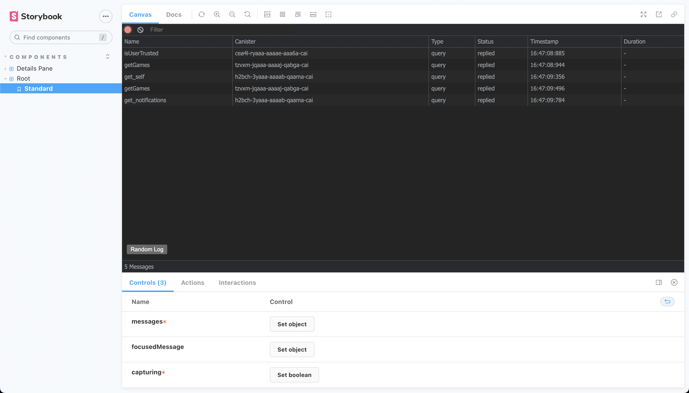

<div style="display: flex; align-items: center; gap: 1em;">
  <a href="https://chromewebstore.google.com/detail/ic-inspector/meaadkenfkhjakkkdapaallimhbdofck" target="_blank">
  
  </a>
  <a href="https://addons.mozilla.org/en-CA/firefox/addon/ic-inspector" target="_blank">
  
  </a>
  <a href="https://chromewebstore.google.com/detail/ic-inspector/meaadkenfkhjakkkdapaallimhbdofck" target="_blank">
  
  </a>
  <a href="https://chromewebstore.google.com/detail/ic-inspector/meaadkenfkhjakkkdapaallimhbdofck" target="_blank">
  
  </a>
</div>
<br />

[The Internet Computer](https://internetcomputer.org/) is a uniquely powerful
blockchain. With this browser extension, you can inspect messages exchanged
between your browser and the IC blockchain. IC Inspector provides developers
with crucial tooling for blockchain projects using the browser devtools paradigm
they already know.



## How Does It Work?

The lifecycle of a message between your browser and any IC smart contract (or
"canister") involves a few layers of encoding.

1. Data on the wire is sent in concise binary object representation (CBOR)
   format. Decoding this is fairly straightfoward.

2. Clients and smart contracts use Candid, a proprietary interface definition
   language (IDL), to encode arugment types, return types, and canister
   interfaces. IC Inspector automatically retrieves IDL definitions from the
   canister itself in order to accurately parse data.

3. An agent library called agent-js runs in the browser, sending https requests
   to boundary nodes which communicate with the blockchain itself. IC Inspector
   monitors these https requests and maps them back into a representation of the
   actual blockchain messages for easy reading.

4. The blockchain returns a pruned merkle tree containing the subset of
   blockchain state which constitutes a particular message response. IC
   Inspector picks your message out of this tree.

## Development

For development with automatic reloading:

```sh
npm run start
```

Open the [Extensions Dashboard](chrome://extensions), enable "Developer mode",
click "Load unpacked", and choose the `dist` folder.

You will see the "Dfinity" tab in your devtools window.

When you make changes in `src` the background script and any content script will
reload automatically.

### Storybook

To simplify testing and development the extension's UIs, storybook is available
with a set of message stubs captured from real IC apps.

`npm run storybook`



## Releasing

Pushing a new tag to github will trigger a release to the chrome webstore.

1. Bump the version in `manifest.json`
2. Create a new git tag with the same string
3. Push code and tags to github

```sh
git tag vX.X.X
git push origin main
git push origin --tags
```

## Funding

This library was originally incentivized by [ICDevs](https://ICDevs.org). You
can view more about the bounty on the
[forum](https://forum.dfinity.org/t/cbor-plug-in-or-tools/4556/27?u=skilesare)
or [website](https://icdevs.org/bounties/2021/11/23/CBOR-plug-in.html). The
bounty was funded by The ICDevs.org commuity and the award paid to
@jorgenbuilder. If you use this library and gain value from it, please consider
a [donation](https://icdevs.org/donations.html) to ICDevs.
