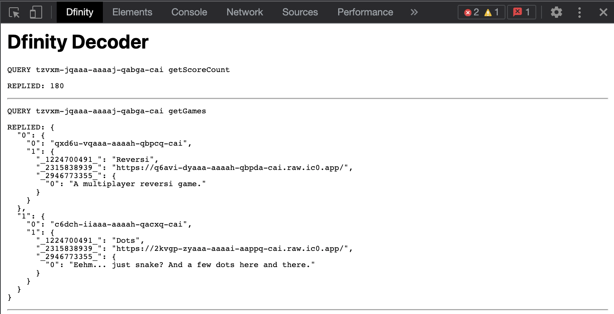

# Dfinity Decoder for Devtools

Warning: work in progress. A little chrome extension to decode CBOR/Candid responses from the Dfinity blockchain in Chrome devtools.

## Why?

Developing on the Dfinity Blockchain, you will see ugly responses in the chrome devtools network tab:

This extension decodes responses from canisters into something more readable:

## Installation and Use

1. git clone
2. load unpacked extension into chrome [readme](https://developer.chrome.com/docs/extensions/mv2/getstarted/)
3. open devtools and select "Dfinity Decoder" tab
4. reload the page

Note: for the moment, you'll need to have the Dfinity Decoder tab open in order to capture network events.